  Cadet at <b>42 Istanbul</b> · MIS <b>@İstinye</b> · AI Engineering Intern <b>@Alpacotech</b> 
  Builds in all weather.

<table>
<tr>
<td valign="top" width="50%">

 **Working on**

- Low-level C and C++ at 42: a shell, a raycaster, threads that (mostly) don't deadlock
- Hackathon projects, from a blank repo to a working demo

</td>
<td valign="top" width="50%">

 **Now learning**

- Machine learning from first principles, linear regression through transformers
- NLP and large language models, from the tokenizer up

</td>
</tr>
</table>

  

