Cadet at **42 Istanbul** · **MIS @İstinye** · **AI Engineering Intern @Alpacotech**

**Working On**
- Low-level C and C++ at 42: a shell, a raycaster, threads that (mostly) don't deadlock
- Hackathon projects, from a blank repo to a working demo

**Now learning**
- Machine learning from first principles, linear regression through transformers
- NLP and large language models
