<picture>
  <source media="(prefers-color-scheme: dark)" srcset="./assets/header-dark.svg">
  <source media="(prefers-color-scheme: light)" srcset="./assets/header-light.svg">
  
</picture>
 

Cadet at **42 Istanbul** · **MIS @İstinye** · **AI Engineering Intern @Alpacotech**

**Working On**
- Low-level C and C++ at 42: a shell, a raycaster, threads that (mostly) don't deadlock
- Hackathon projects, from a blank repo to a working demo
- AI agents and the long-running build loops around them

**Now learning**
- Machine learning from first principles, linear regression through transformers
- NLP and large language models
- Agents that finish the job with no one watching
